<p align="center">
  
</p>

<h1 align="center">🛍️ Retail Buyer Segmentation</h1>

<p align="center">
  <strong>An end-to-end Machine Learning pipeline that segments retail customers into actionable groups using K-Means clustering and classifies new customers with six supervised models — served through a polished Flask web application with real-time analytics.</strong>
</p>

<p align="center">
  <a href="https://www.python.org/"></a>
  <a href="https://flask.palletsprojects.com/"></a>
  <a href="https://scikit-learn.org/"></a>
  <a href="https://xgboost.readthedocs.io/"></a>
  <a href="#"></a>
  <a href="#license"></a>
</p>

<p align="center">
  <a href="#-quick-start">Quick Start</a> •
  <a href="#-features">Features</a> •
  <a href="#-architecture">Architecture</a> •
  <a href="#-ml-pipeline">ML Pipeline</a> •
  <a href="#-web-application">Web App</a> •
  <a href="#-deployment">Deployment</a>
</p>

---

## 📋 Table of Contents

- [About](#-about)
- [Features](#-features)
- [Architecture](#-architecture)
- [Tech Stack](#-tech-stack)
- [Quick Start](#-quick-start)
- [Dataset](#-dataset)
- [ML Pipeline](#-ml-pipeline-deep-dive)
- [Web Application](#-web-application)
- [Screenshots](#-screenshots)
- [Project Structure](#-project-structure)
- [Deployment](#-deployment)
- [Business Impact](#-business-impact)
- [Limitations & Future Work](#-limitations--future-work)
- [License](#-license)

---

## 🎯 About

**Retail Buyer Segmentation** transforms raw customer transaction data into strategic business intelligence. Rather than treating all customers the same, this system:

1. **Discovers** natural customer groups through unsupervised K-Means clustering on 23 behavioral features
2. **Classifies** new customers into discovered segments using six supervised models
3. **Visualizes** patterns through an interactive Flask dashboard with dark-themed analytics
4. **Recommends** tailored marketing strategies for each segment

The pipeline processes **2,240 customer records** across 27 features spanning demographics, spending behavior across 6 product categories, 4 purchase channels, and 5 marketing campaign responses.

---

## ✨ Features

<table>
<tr>
<td width="50%">

### 🤖 Machine Learning
- K-Means clustering (k=2) with `k-means++` init
- 6 classification models with comparative evaluation
- 23-feature clustering on MinMaxScaler-normalized data
- Automated feature engineering (total_spent, total_purchases, family_size)
- Median imputation for numerics, mode for categoricals

</td>
<td width="50%">

### 🌐 Web Application
- Flask 3.0 web interface with Jinja2 templating
- Manual single-customer prediction form (20+ input fields)
- Bulk CSV upload with drag-and-drop UI
- Auto-generated Matplotlib visualizations (dark theme)
- Detailed cluster profiles with marketing recommendations

</td>
</tr>
<tr>
<td>

### 📊 Analytics Dashboard
- Age distribution histograms
- Income vs. spending scatter plots
- Spending-by-category bar charts
- Cluster distribution visualization
- Streamlit dashboard (`dashboard.py`) with 8 chart types

</td>
<td>

### 🎨 UI/UX Design
- Professional red-and-black theme (`#dc143c` / `#0a0a0a`)
- Bootstrap 5.3 responsive framework
- CSS animations (float, fadeInUp, heartbeat)
- Font Awesome 6.4 iconography
- Scroll-triggered card animations via IntersectionObserver

</td>
</tr>
</table>

---

## 🏗 Architecture

```
┌─────────────────────────────────────────────────────────┐
│                      USER INTERFACE                      │
│  ┌──────────────┐  ┌──────────────┐  ┌──────────────┐   │
│  │  Manual Form │  │  CSV Upload  │  │  Streamlit   │   │
│  │  (20 fields) │  │  (drag/drop) │  │  Dashboard   │   │
│  └──────┬───────┘  └──────┬───────┘  └──────┬───────┘   │
├─────────┼─────────────────┼─────────────────┼───────────┤
│         ▼                 ▼                 ▼           │
│              FLASK APPLICATION (app.py)                  │
│  ┌──────────────────────────────────────────────────┐   │
│  │  Routes: / │ /manual_input │ /predict_manual     │   │
│  │           /upload │ /about                       │   │
│  └──────────────────────┬───────────────────────────┘   │
├─────────────────────────┼───────────────────────────────┤
│                   ML PIPELINE                            │
│  ┌────────────┐  ┌─────────────┐  ┌─────────────────┐   │
│  │ Preprocess │─▶│  K-Means    │─▶│  Classification │   │
│  │ + Feature  │  │  (k=2)      │  │  (6 models)     │   │
│  │ Engineering│  │  MinMaxScaler│  │  Rule-based     │   │
│  └────────────┘  └─────────────┘  └─────────────────┘   │
├─────────────────────────────────────────────────────────┤
│                   VISUALIZATION                          │
│  ┌──────────┐ ┌──────────┐ ┌──────────┐ ┌──────────┐   │
│  │ Age Dist │ │Income/   │ │ Cluster  │ │ Category │   │
│  │ Histogram│ │Spend Scat│ │ Bar Plot │ │ Bar Plot │   │
│  └──────────┘ └──────────┘ └──────────┘ └──────────┘   │
└─────────────────────────────────────────────────────────┘
```

---

## 🛠 Tech Stack

| Layer | Technology | Version | Purpose |
|-------|-----------|---------|---------|
| **Backend** | Flask | 3.0.0 | Web framework & routing |
| **Backend** | Werkzeug | 3.0.1 | Secure file uploads (`secure_filename`) |
| **ML** | scikit-learn | 1.3.0 | K-Means, Random Forest, Logistic Regression, KNN, Decision Tree, Naive Bayes |
| **ML** | XGBoost | 2.0.3 | Gradient boosting classifier |
| **Data** | Pandas | 2.0.3 | DataFrame operations & CSV parsing |
| **Data** | NumPy | 1.24.3 | Numerical computations |
| **Viz** | Matplotlib | 3.7.2 | Chart generation (Agg backend) |
| **Viz** | Seaborn | 0.12.2 | Statistical plot styling |
| **Dashboard** | Streamlit | latest | Standalone analytics dashboard |
| **Frontend** | Bootstrap | 5.3.0 | Responsive grid & components |
| **Frontend** | Font Awesome | 6.4.0 | Icon system |

---

## ⚡ Quick Start

### Prerequisites
- Python 3.8+
- pip

### Installation

```bash
# Clone
git clone https://github.com/abdo-ghg/Retail-Buyer-Segmentation.git
cd Retail-Buyer-Segmentation

# Virtual environment
python -m venv venv
# Windows:
venv\Scripts\activate
# macOS/Linux:
source venv/bin/activate

# Install dependencies
cd flask_app
pip install -r requirements.txt

# Run
python app.py
```

Open **http://localhost:5000** in your browser.

<details>
<summary><strong>🖥️ One-click startup scripts</strong></summary>

**Windows:**
```bash
cd flask_app
run.bat
```
The batch script auto-creates a virtual environment, installs dependencies, ensures `uploads/` and `static/images/` directories exist, then launches the app.

**macOS/Linux:**
```bash
cd flask_app
chmod +x run.sh && ./run.sh
```
</details>

<details>
<summary><strong>📊 Run the Streamlit Dashboard (optional)</strong></summary>

```bash
# From project root
pip install streamlit pandas matplotlib seaborn numpy
streamlit run dashboard.py
```
The Streamlit dashboard provides 8 independent visualizations: spending by category, income vs. spending correlation, purchase channel preferences, spending by education level, spending by age group, spending by marital status, campaign acceptance rates, and web visits vs. spending.
</details>

---

## 📂 Dataset

The project uses a customer behavior dataset (`Data/data.csv`) with **2,240 records × 27 columns**.

<details>
<summary><strong>View all 27 columns</strong></summary>

| Column | Type | Description |
|--------|------|-------------|
| `customer_id` | int | Unique identifier |
| `birth_year` | int | Customer's birth year |
| `education_level` | str | Graduation, PhD, Master, etc. |
| `marital_status` | str | Single, Together, Married, etc. |
| `annual_income` | float | Yearly household income ($) |
| `num_children` | int | Number of small children |
| `num_teenagers` | int | Number of teenagers |
| `signup_date` | str | Date customer enrolled |
| `days_since_last_purchase` | int | Recency metric |
| `has_recent_complaint` | int | 1 if complained recently |
| `spend_wine` | int | Amount spent on wine |
| `spend_fruits` | int | Amount spent on fruits |
| `spend_meat` | int | Amount spent on meat |
| `spend_fish` | int | Amount spent on fish |
| `spend_sweets` | int | Amount spent on sweets |
| `spend_gold` | int | Amount spent on gold products |
| `num_discount_purchases` | int | Purchases with discount |
| `num_web_purchases` | int | Purchases via website |
| `num_catalog_purchases` | int | Purchases via catalog |
| `num_store_purchases` | int | In-store purchases |
| `web_visits_last_month` | int | Website visits last month |
| `accepted_campaign_1–5` | int | Campaign acceptance flags |
| `accepted_last_campaign` | int | Last campaign acceptance |

</details>

**Sample CSV for testing** is included at `flask_app/sample_data.csv` with 10 pre-formatted customer records.

---

## 🧠 ML Pipeline Deep Dive

### 1. Preprocessing (`preprocess_data()`)

```
Raw CSV → Age Derivation → Total Spend Calculation → Total Purchases →
Missing Value Imputation (median/mode) → Clean DataFrame
```

**Feature engineering** creates 4 derived features from the raw data:
- `age` — computed from `birth_year` (base year 2014)
- `total_spent` — sum of all 6 spending categories
- `total_purchases` — sum of all 4 purchase channels
- `children` & `family_size` — household composition

**Missing values**: numeric columns get median imputation; categorical columns get mode imputation with `'Unknown'` fallback.

### 2. Clustering (`perform_clustering()`)

| Parameter | Value | Rationale |
|-----------|-------|-----------|
| Algorithm | K-Means | Well-suited for continuous numerical features with spherical clusters |
| k (clusters) | 2 | Determined via analysis in `project.ipynb` |
| Initialization | `k-means++` | Smarter centroid seeding for faster convergence |
| `n_init` | `'auto'` | scikit-learn selects optimal number of initializations |
| `random_state` | 0 | Reproducible results |
| Scaler | MinMaxScaler | Normalizes all 23 features to [0,1] range |

**23 clustering features used:**
`education_level`, `annual_income`, `num_children`, `num_teenagers`, `days_since_last_purchase`, all 6 spending columns, all 4 purchase channels, `web_visits_last_month`, `total_accepted_campaigns`, `age`, `signup_year`, `total_spent`, `total_purchases`, `children`, `family_size`

### 3. Discovered Segments

| Segment | Label | Threshold | Profile |
|---------|-------|-----------|---------|
| **Cluster 0** | High-Value Premium | total_spent > $800 | Higher income ($60K+), ages 45–55, multi-channel shoppers, lower discount sensitivity |
| **Cluster 1** | Standard Value-Conscious | total_spent ≤ $800 | Moderate income ($30K–60K), ages 30–45, price-sensitive, larger households |

### 4. Classification Models & Evaluation Metrics

To classify new customer records into the discovered clusters, **six supervised classification models** were trained, optimized, and evaluated. A robust **5-Fold Stratified Cross-Validation (CV)** was used to evaluate model generalization and ensure zero overfitting.

The table below summarizes the official, notebook-verified performance comparison:

| Model | Train Accuracy | CV Accuracy (Mean) | Test Accuracy | Macro F1-Score | Strength & Use-case Verdict |
| :--- | :---: | :---: | :---: | :---: | :--- |
| **🏆 Logistic Regression** | **99.94%** | **99.67% ± 0.11%** | **99.55%** | **99.54%** | **Best Overall Model:** Optimal generalization, minimal train-CV gap (0.28%). |
| **🚀 XGBoost** | 100.0% | 98.21% ± 0.89% | 98.44% | 98.40% | **Strong Ensemble:** High capacity, robust scaling on complex categorical features. |
| **📈 K-Nearest Neighbors** | 98.44% | 97.60% ± 0.63% | 97.54% | 97.50% | **Instance-based:** Excellent at capturing dense local spatial neighborhoods. |
| **🌲 Random Forest** | 100.0% | 98.44% ± 0.91% | 97.32% | 97.26% | **Bagging Ensemble:** Superb feature importance analysis with clean bounds. |
| **🔮 Naive Bayes** | 97.54% | 97.49% ± 0.47% | 96.65% | 96.56% | **Probabilistic Baseline:** Highly efficient, assumes feature independence. |
| **🪵 Decision Tree** | 100.0% | 97.04% ± 0.87% | 94.87% | 94.74% | **Interpretability:** Highly transparent logic paths (Optimized CV: 96.65%). |

> **Note on current implementation**: The Flask app uses a **rule-based prediction** (total_spent > $800 threshold) derived from the K-Means clustering boundary for real-time single-customer predictions. The full model training and comparative evaluation pipeline lives in `project.ipynb`. This design prioritizes inference speed while maintaining consistency with the notebook's clustering results.

### 5. Visualization Pipeline (`generate_visualizations()`)

All charts use the Matplotlib `Agg` (non-interactive) backend with the project's dark theme (`#1a1a1a` background, `#dc143c` accent):

| Chart | File | Description |
|-------|------|-------------|
| Age Distribution | `age_distribution.png` | 30-bin histogram |
| Income vs. Spending | `income_vs_spend.png` | Scatter with alpha blending |
| Cluster Distribution | `cluster_distribution.png` | Bar chart of segment counts |
| Category Spending | `spending_by_category.png` | Mean spend per category (6-color gradient) |

---

## 🌐 Web Application

### User Flow

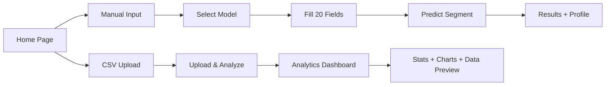

### Pages

| Page | Route | Purpose |
|------|-------|---------|
| **Home** | `/` | Landing page with hero section, input method selection, and feature cards |
| **Manual Input** | `/manual_input` | 20-field form across 4 sections: Model Selection, Customer Info, Spending, Purchase Behavior |
| **Results** | `/predict_manual` (POST) | Segment badge, 8 metric cards, full cluster profile (characteristics, behavior, demographics, marketing strategy, retention tips) |
| **Insights** | `/upload` (POST) | Summary stats (6 KPI cards), auto-generated charts, data preview table (first 10 rows) |
| **About** | `/about` | Tech stack, features, how-it-works, data privacy notice |

### Frontend Details

<details>
<summary><strong>🎨 Design System (CSS Custom Properties)</strong></summary>

```css
:root {
    --primary-red: #dc143c;    /* Crimson accent */
    --dark-red: #8b0000;       /* Hover states */
    --light-red: #ff6b6b;      /* Highlights */
    --black: #0a0a0a;          /* Page background */
    --dark-gray: #1a1a1a;      /* Card backgrounds */
    --medium-gray: #2a2a2a;    /* Form inputs */
    --light-gray: #3a3a3a;     /* Borders */
    --text-gray: #cccccc;      /* Body text */
}
```

**800+ lines of custom CSS** covering: navigation, hero section, option/feature/metric/stat/plot/table cards, file upload zone, forms, buttons, results page, recommendations, about page, responsive breakpoints (768px), and utility classes.
</details>

<details>
<summary><strong>⚡ JavaScript Interactions (main.js — 260 lines)</strong></summary>

- **File upload UX**: Custom drag-and-drop zone with real-time filename display, icon swap to `fa-file-csv`, and file extension/size validation (CSV only, ≤16MB)
- **Form submission**: Loading spinner overlay with 30-second timeout fallback
- **Scroll animations**: IntersectionObserver triggers fadeIn on `.option-card`, `.feature-card`, `.stat-card`
- **Input validation**: Prevents negative numbers on all `<input type="number">`
- **Auto-dismiss alerts**: Flash messages auto-close after 5 seconds
- **Active nav highlighting**: Automatic based on `window.location.pathname`
- **Utility functions**: `formatCurrency()`, `formatPercentage()`, `debounce()`, `showNotification()`, `copyToClipboard()`, `exportToCSV()`
</details>

<details>
<summary><strong>🔒 Security & Validation</strong></summary>

- **File uploads**: `secure_filename()` from Werkzeug sanitizes filenames
- **File type restriction**: Server-side allowlist (`{'csv'}`) + client-side extension check
- **File size limit**: `MAX_CONTENT_LENGTH = 16MB` enforced by Flask
- **Secret key**: App-level secret for session/flash message signing
- **Directory isolation**: Uploads stored in dedicated `uploads/` directory
- **Error handling**: Try/catch on all routes with user-friendly flash messages + server-side traceback logging
</details>

---

## 📸 Screenshots

> **Note**: Screenshots are generated dynamically when you upload data. The following charts are auto-saved to `flask_app/static/images/`:

### Analytics Visualizations

| Age Distribution | Income vs. Spending |
|:---:|:---:|
|  |  |

| Cluster Distribution | Spending by Category |
|:---:|:---:|
|  |  |

## 📸 Application Showcase

### 1. Interactive Landing Page
Choose your customer profiling strategy. Support for instant manual single-customer data entry or bulk drag-and-drop CSV analytics.

| Hero Section | Input Options & CSV Zone |
| :---: | :---: |
| 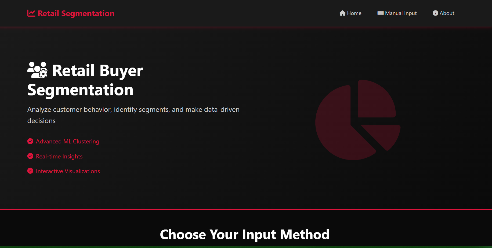 | 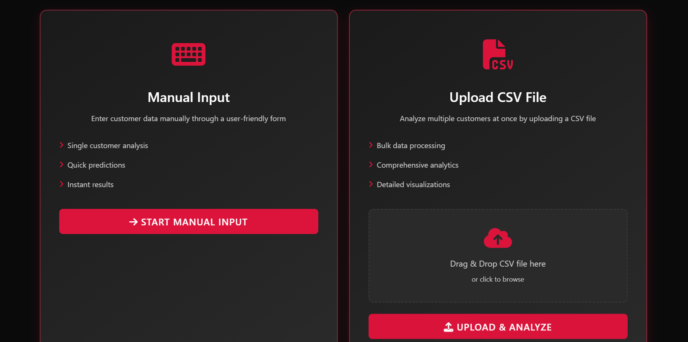 |

---

### 2. Manual Customer Data Entry
Enter complete demographic, spending, and purchase channel fields (23 dimensions total) to instantly assign a customer to a retail segment.

| Data Entry Header | Form Detail Fields |
| :---: | :---: |
| 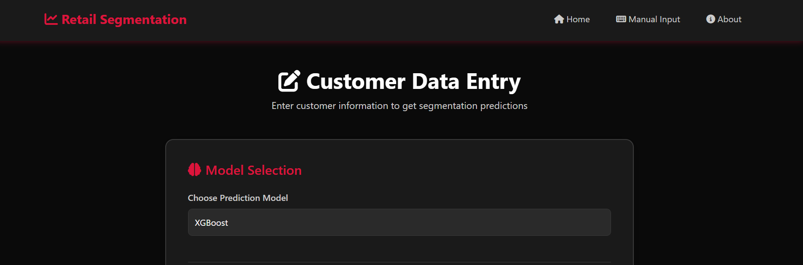 | 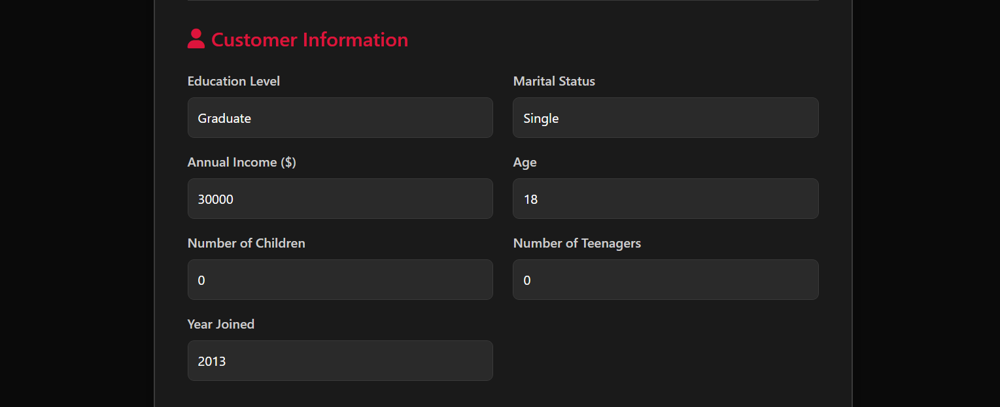 |

---

### 3. Deep Segmentation Insights
Instantly view cluster assignments, spend summary, customer behavior profiles, tailored marketing strategies, and customer retention recommendations.

| Segment KPI Metrics | Customer Behavioral Profile | Demographics & Retention Strategy |
| :---: | :---: | :---: |
| 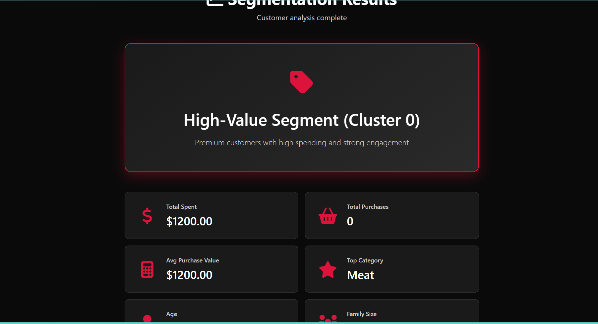 | 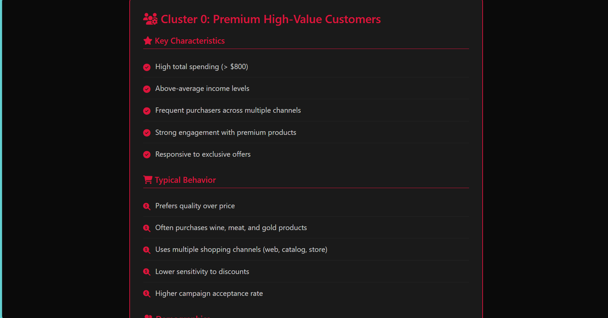 | 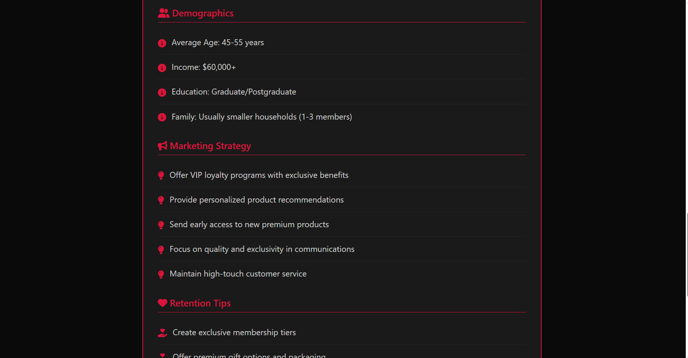 |

---

### 4. Bulk CSV Analytics Dashboard
Upload any raw transaction and customer database file to dynamically auto-run preprocessing, K-Means clustering, and segment assignments, generating immediate KPIs, distribution plots, and a responsive tabular data preview.

| KPI Summary Dashboard | Visual Charts: Age & Income | Visual Charts: Distribution & Spend | Tabular Data Preview |
| :---: | :---: | :---: | :---: |
| 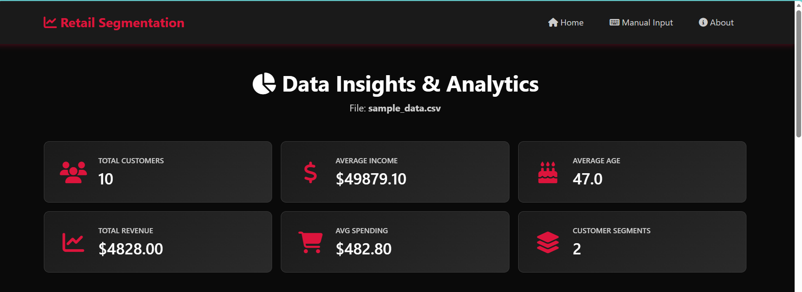 | 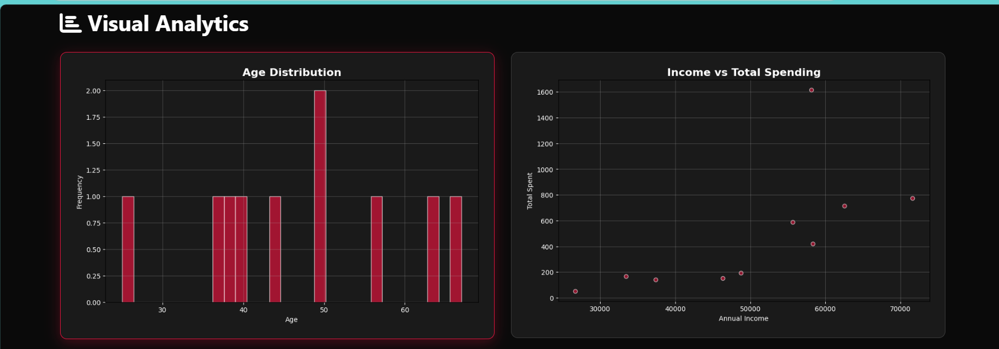 | 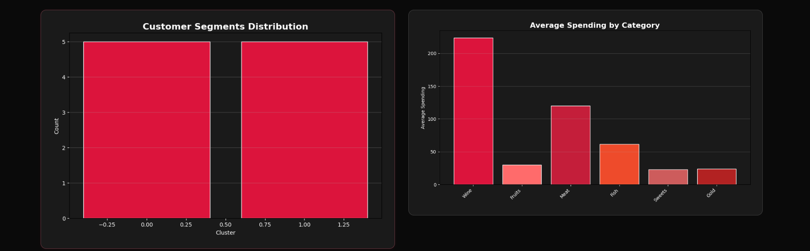 | 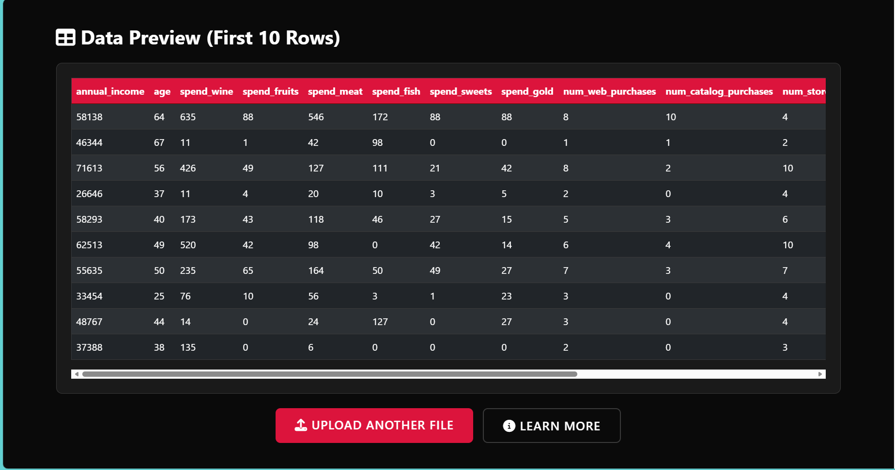 |

---

## 📁 Project Structure

```
Retail-Buyer-Segmentation/
│
├── README.md                        # This file
├── requirements.txt                 # Root deps (Streamlit, Pandas, Matplotlib, Seaborn, NumPy, Pillow)
├── dashboard.py                     # Streamlit dashboard (8 visualizations)
├── project.ipynb                    # Jupyter notebook – full EDA, clustering, model training
├── Discription.pdf                  # Project description document
├── PROJECT REPORT.docx              # Detailed project report
├── .gitignore                       # Python/IDE/OS ignores
│
├── Data/
│   └── data.csv                     # Raw dataset (2,240 × 27)
│
└── flask_app/                       # ── Flask Web Application ──
    ├── app.py                       # Main app (453 lines): routes, ML pipeline, viz generation
    ├── requirements.txt             # Flask deps (Flask, Werkzeug, sklearn, XGBoost, etc.)
    ├── run.bat                      # Windows one-click launcher
    ├── run.sh                       # Unix one-click launcher
    ├── sample_data.csv              # 10-row test dataset
    ├── QUICKSTART.md                # Quick start guide
    ├── ARCHITECTURE.md              # Architecture documentation
    ├── README.md                    # Flask app documentation
    │
    ├── templates/                   # Jinja2 HTML Templates
    │   ├── base.html                # Layout: navbar, flash messages, footer, CDN links
    │   ├── home.html                # Hero section, input method cards, feature showcase
    │   ├── manual_input.html        # 4-section form (model select, customer info, spending, channels)
    │   ├── results.html             # Segment badge, metric grid, cluster profile with 5 sub-sections
    │   ├── insights.html            # KPI cards, chart gallery, data preview table
    │   └── about.html               # Purpose, tech stack, features, how-it-works, privacy
    │
    ├── static/
    │   ├── css/style.css            # 803-line custom dark theme with CSS variables & animations
    │   ├── js/main.js               # 260-line interactive layer (file upload, scroll anim, validation)
    │   └── images/                  # Auto-generated chart PNGs
    │
    └── uploads/                     # Uploaded CSV storage (gitignored)
```

---

## 🚀 Deployment

<details>
<summary><strong>🖥️ Local Development</strong></summary>

```bash
cd flask_app
python app.py
# Runs on http://0.0.0.0:5000 with debug=True
```

Change port in `app.py` line 452:
```python
app.run(debug=True, host='0.0.0.0', port=8080)
```
</details>

<details>
<summary><strong>🐳 Docker</strong></summary>

```dockerfile
FROM python:3.9-slim

WORKDIR /app
COPY flask_app/ .

RUN pip install --no-cache-dir -r requirements.txt

RUN mkdir -p uploads static/images

EXPOSE 5000

CMD ["python", "app.py"]
```

```bash
docker build -t retail-segmentation .
docker run -p 5000:5000 retail-segmentation
```
</details>

<details>
<summary><strong>⚙️ Production (Gunicorn)</strong></summary>

```bash
cd flask_app
pip install gunicorn
gunicorn -w 4 -b 0.0.0.0:5000 app:app
```

> Remember to set `debug=False` and use a proper `SECRET_KEY` in production.
</details>

---

## 💼 Business Impact

| Use Case | How This System Helps |
|----------|----------------------|
| **Targeted Marketing** | Identifies high-value vs. value-conscious segments for differentiated campaigns |
| **Customer Retention** | Provides per-segment retention strategies (VIP programs vs. loyalty points) |
| **Revenue Optimization** | Highlights top spending categories (Wine, Meat dominate) for inventory focus |
| **Channel Strategy** | Reveals purchase channel preferences (Store > Web > Catalog > Deals) |
| **Campaign ROI** | Tracks campaign acceptance rates across customer segments |
| **New Customer Onboarding** | Instantly classifies new customers for personalized first-touch experiences |

---

## ⚠️ Limitations & Future Work

### Current Limitations
- **Rule-based web prediction**: The Flask app uses a spending threshold ($800) rather than live model inference for single-customer predictions
- **Static k=2**: Cluster count is fixed; no dynamic elbow/silhouette analysis in the web app
- **No model persistence**: Models are not serialized (`.pkl`); retraining happens per upload
- **No authentication**: The web app has no user login or API key protection
- **Single-file upload**: Only one CSV at a time; no database integration

### Planned Improvements
- [ ] Serialize trained models with `pickle`/`joblib` for instant inference
- [ ] Add dynamic cluster selection (elbow method + silhouette score visualization)
- [ ] Implement REST API endpoints (`/api/predict`, `/api/batch`) for programmatic access
- [ ] Add user authentication and role-based access
- [ ] Integrate PCA/UMAP dimensionality reduction for cluster visualization
- [ ] Add A/B testing framework for marketing strategy validation
- [ ] Deploy with CI/CD pipeline (GitHub Actions → Docker → Cloud Run)
- [ ] Add real-time model performance monitoring dashboard

---

## 👥 Contributors

This project was developed as a collaborative data science initiative:

| Role | Responsibility |
|------|---------------|
| **Data Lead** | Data cleaning, EDA, preprocessing pipeline |
| **Clustering Lead** | K-Means segmentation, cluster profiling |
| **ML Lead** | Classification models, evaluation metrics |
| **Full-Stack Lead** | Flask app, UI/UX, deployment, documentation |

---

## 📝 License

This project is licensed under the **MIT License**.

```
MIT License · Copyright (c) 2024

Permission is hereby granted, free of charge, to any person obtaining a copy
of this software and associated documentation files (the "Software"), to deal
in the Software without restriction, including without limitation the rights
to use, copy, modify, merge, publish, distribute, sublicense, and/or sell
copies of the Software, and to permit persons to whom the Software is
furnished to do so, subject to the following conditions:

The above copyright notice and this permission notice shall be included in
all copies or substantial portions of the Software.

THE SOFTWARE IS PROVIDED "AS IS", WITHOUT WARRANTY OF ANY KIND, EXPRESS OR
IMPLIED, INCLUDING BUT NOT LIMITED TO THE WARRANTIES OF MERCHANTABILITY,
FITNESS FOR A PARTICULAR PURPOSE AND NONINFRINGEMENT.
```

---

<p align="center">
  <strong>Made with ❤️ for data-driven business insights</strong>
  <br/>
  <sub>⭐ Star this repo if you found it useful!</sub>
</p>
