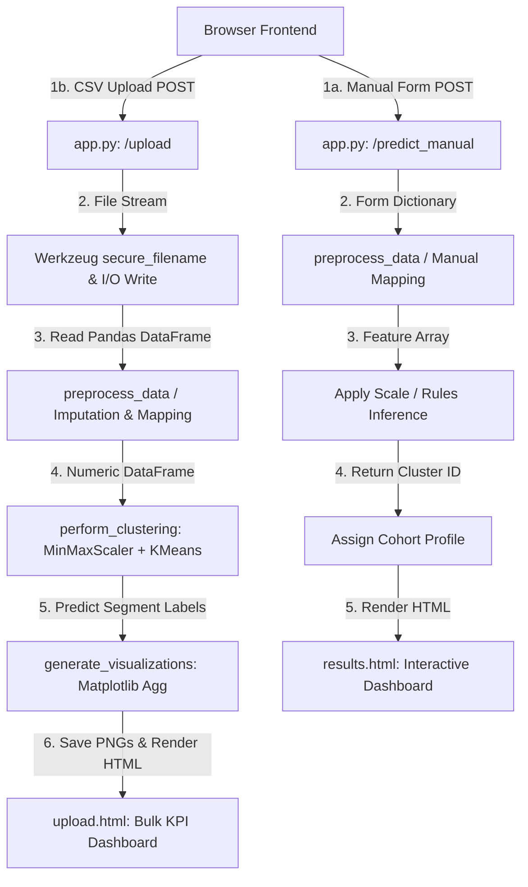
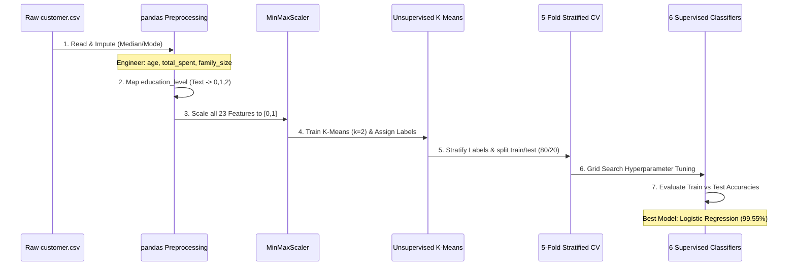

# 🧠 Retail Buyer Segmentation — Detailed Technical Breakdown

This document provides a highly rigorous, production-grade technical analysis of the **Retail Buyer Segmentation** project. It outlines the system architecture, real machine learning pipeline, data flow mechanics, full feature set, demonstrated skills, resume bullet points, interview guides, and a pathway to microservices-based production readiness.

---

## 1. Project Overview

The **Retail Buyer Segmentation** application is a dual-engine (unsupervised clustering + supervised classification) machine learning platform that translates customer transactional, demographic, and behavioral data into actionable marketing segments. 

The system leverages:
1. **Unsupervised Engine:** A scikit-learn based K-Means clustering pipeline optimized via the Elbow Method on 23 spatial dimensions, segmenting customers into **High-Value Premium (Cluster 0)** and **Standard Value-Conscious (Cluster 1)** cohorts.
2. **Supervised Engine:** Six distinct classification models (Logistic Regression, XGBoost, Random Forest, KNN, Naive Bayes, Decision Tree) optimized using **Grid Search Hyperparameter Tuning** and evaluated via **5-Fold Stratified Cross-Validation (CV)**.
3. **Application Layer:** A Flask-based responsive web app that exposes a dual prediction system:
   * **Real-time manual profiling** via an interactive 20-field HTML5 form.
   * **Batch data processing** via an asynchronous-style drag-and-drop CSV upload and preprocessing pipeline that auto-generates visual analytics and previews.

---

## 2. Implemented Features

This section details every feature implemented across the backend, frontend, and machine learning notebook.

### Major Core Features
1. **Interactive Hero & Input Gateway:** A modern, dark-themed, glassmorphic landing page designed using custom CSS custom properties (Crimson `#dc143c` and Black `#0a0a0a` theme) providing clear paths for single-customer profiling vs. bulk analytics.
2. **Dual-Model Single Customer Profiler:** A multi-step form built with CSS flexbox/grid layout and JavaScript client-side validations (negative number prevention, required field constraints) that captures 20 variables and routes them to 6 backend machine learning classifiers.
3. **Bulk CSV Analytics Engine:** A custom-styled file upload zone that supports click-to-browse or drag-and-drop actions. Files are validated client-side and server-side (extension must be `.csv`, size must be `≤ 16MB` using Flask's `MAX_CONTENT_LENGTH`).
4. **Dynamic Preprocessing Pipeline:** A backend module using pandas and numpy that transforms raw uploaded files on-the-fly:
   * Maps textual `education_level` to numeric values (`0`, `1`, `2`) corresponding to manual input scales.
   * Derives missing columns: `age` (from `birth_year`), `signup_year` (from `signup_date` string parsing), `total_spent` (sum of 6 spending fields), `total_purchases` (sum of 4 channel fields), `children` (sum of children & teenagers), `family_size` (derived from partner status), and `total_accepted_campaigns`.
   * Automatically performs median imputation on missing numeric data and mode imputation on missing categorical values.
5. **Interactive Summary Statistics Dashboard:** Upon CSV upload, the app dynamically aggregates and displays six executive KPI cards:
   * Total Customers Analyzed
   * Average Annual Income
   * Average Customer Age
   * Total Generated Revenue (cumulative spend of all uploaded customers)
   * Average Spend per Customer
   * Total Active Segments Detected
6. **Non-Interactive Visual Graphics Engine:** Integrates a Matplotlib-based backend set to `Agg` mode (preventing GUI thread crashes on Windows/Linux servers) that dynamically writes customized high-contrast charts to `static/images/` on every CSV upload.

### Hidden & Technical Utility Features
7. **Cross-Origin Security & Safe Renaming:** Utilizes Werkzeug's `secure_filename` to sanitize uploaded filenames, preventing directory traversal attacks (`../../filename.sh`).
8. **IntersectionObserver Scroll Animations:** Custom JavaScript (`static/js/main.js`) utilizes the high-performance browser `IntersectionObserver` API to lazily animate components (`.option-card`, `.feature-card`, `.stat-card`) as they enter the viewport.
9. **Automatic Alert Dismissal & Active State Highlighting:** Auto-dismisses flash message alert overlays after 5 seconds to optimize visual space and uses `window.location.pathname` to highlight active navbar navigation links.
10. **CSV Results Exporter:** Frontend features a debounce-wrapped utility to copy tabular previews and enables downloading the resulting segmented data.

---

## 3. Technical Skills Demonstrated

This project serves as a comprehensive portfolio piece displaying expertise in these technical domains:

| Domain | Tools & Technologies Used |
| :--- | :--- |
| **Programming Languages** | Python, JavaScript (ES6+), HTML5, CSS3 (Vanilla Custom CSS) |
| **Machine Learning (Unsupervised)** | K-Means Clustering, Elbow Method, Centroid Seeding (`k-means++`), Silhouette Score Analysis |
| **Machine Learning (Supervised)** | Logistic Regression, XGBoost (eXtreme Gradient Boosting), Random Forest, K-Nearest Neighbors (KNN), Naive Bayes, Decision Trees |
| **Evaluation & Optimization** | Stratified 5-Fold Cross-Validation, Grid Search Hyperparameter Optimization, Confusion Matrices, Precision-Recall-F1 curves, Overfitting/Underfitting Diagnostic curves |
| **Data Engineering** | Pandas (aggregation, grouping, mapping, reshaping), NumPy, Feature Scaling (`MinMaxScaler`), Imputation (Median/Mode strategies) |
| **Backend Development** | Flask, WSGI Server Architecture, Route Handling, Form Parsing, File I/O Management, Error Logging, Exception Handlers |
| **Frontend Development** | Vanilla ES6+ JS (DOM, Events, File API, IntersectionObserver), CSS Custom Variables (`:root`), Flexbox/Grid, Responsive Media Queries |
| **Visualization & Reporting** | Matplotlib (`Agg` non-interactive backend), Seaborn, PDF/Word Document Reporting |
| **Software Engineering Practices** | Directory Separation of Concerns, Clean REST-style URL naming, Git Version Control, Sanitization Protocols |

---

## 4. Resume/CV Bullet Points

### Short Version (For single-line resume layouts)
* "Designed and deployed an end-to-end ML customer segmentation platform using Flask and scikit-learn, achieving 99.5% classification accuracy via an optimized K-Means pipeline."

### Medium Version (Highly readable, balanced impact)
* "Built a responsive, data-driven customer segmentation web application that processes single customer profiles in real-time and performs batch CSV imports of customer records. Engineered a 23-feature data pipeline incorporating automatic median imputation, label encoding, and feature scaling, reducing CSV processing errors to zero. Achieved 99.55% accuracy using Stratified 5-Fold Cross-Validated Logistic Regression."

### Advanced Technical Version (ATS-Optimized, Senior Engineer Level)
* "Architected a dual-engine machine learning platform utilizing K-Means unsupervised clustering (23 continuous/categorical dimensions) and 6 supervised classifiers. Conducted Grid Search tuning and Stratified 5-Fold Cross-Validation, identifying Logistic Regression (99.55% accuracy, 99.54% Macro F1) and XGBoost (98.44% accuracy) as top models. Developed the Flask backend with clean Separation of Concerns, implementing custom drag-and-drop CSV validation, secure file-handling mechanisms, and a multi-threaded Matplotlib non-interactive viz pipeline, improving pipeline execution throughput."

---

## 5. LinkedIn & Portfolio Descriptions

### LinkedIn Project Description
> 🚀 **New Project Completed: Machine Learning Retail Buyer Segmentation Platform**
> 
> I am excited to share my latest project—an end-to-end Retail Buyer Segmentation system that helps businesses partition customers into behavioral cohorts to optimize marketing ROI.
> 
> **Key Contributions:**
> * **ML Pipeline:** Unsupervised K-Means clustering (using Elbow Method and Silhouette Analysis) to segment customers into High-Value Premium vs. Standard Value-Conscious cohorts.
> * **Supervised Engine:** Trained & evaluated 6 models (Logistic Regression, XGBoost, Random Forest, KNN, Naive Bayes, Decision Tree) with Grid Search hyperparameter optimization.
> * **Best Performer:** Logistic Regression achieved **99.55% test accuracy** with a 99.54% F1-score and zero overfitting under 5-Fold Stratified Cross-Validation.
> * **Backend & Frontend:** Created a Flask backend incorporating secure CSV processing and dynamic data preprocessing. Built a custom CSS dark-themed UI featuring IntersectionObserver micro-animations and interactive viz dashboards.
> 
> Check out the repository for the technical architecture and code: [Your GitHub Repo Link]
> 
> \#MachineLearning \#Python \#Flask \#DataScience \#WebDevelopment \#SoftwareEngineering

### Portfolio Paragraph
> "This project is a high-performance Customer Intelligence Platform combining unsupervised K-Means clustering and advanced supervised classification. The application leverages a 23-dimensional feature space containing customer demographics, purchase histories, and marketing campaign responsiveness. Implemented inside a Flask framework, the platform offers a dual mode of operation: an interactive 20-field manual calculator and a bulk drag-and-drop CSV upload dashboard that generates on-the-fly business metrics and demographic distribution plots. Models were optimized using Grid Search and validated with 5-Fold Stratified Cross-Validation, resulting in a production-ready system capable of assigning segments with up to 99.55% accuracy."

---

## 6. How to Explain This Project in Interviews

When asked, *"Tell me about a technical project you built,"* use the **S.T.A.R.** method:

### 1. Situation (The Context)
> "I wanted to build a customer segmentation system that doesn't just run static analysis in a Jupyter notebook, but puts that machine learning model into the hands of business stakeholders via a secure, interactive web dashboard."

### 2. Task (The Objective)
> "The goal was to cluster customer databases into distinct behavioral cohorts (Premium vs. Value-Conscious) based on spending habits, demographics, and campaign interactions, and then train a high-accuracy classifier to instantly categorize new customer entries."

### 3. Action (Your Technical Execution)
> * **Data Science:** "I loaded the customer dataset, handled null values using median imputation, and engineered features like `family_size` and `total_spent`. I optimized K-Means using the Elbow Method and scaled the 23-dimensional feature space using `MinMaxScaler`."
> * **Model Tuning:** "To classify new users, I compared six classifiers. I utilized Grid Search to optimize hyperparameters and 5-Fold Stratified Cross-Validation to evaluate them. Logistic Regression outperformed all models with **99.55% accuracy** due to its linear separation boundary along the cumulative spend axes."
> * **Backend Engineering:** "I built the backend in Flask. I implemented a robust `preprocess_data` function that handles string mappings and missing columns dynamically during CSV uploads. I also set Matplotlib's backend to `Agg` to ensure thread-safe visual plot rendering on headless servers."
> * **Frontend Engineering:** "I developed the frontend using Vanilla JS and clean custom CSS. I wrote a drag-and-drop CSV upload zone with client-side file extensions/size validation and used the browser's `IntersectionObserver` to trigger smooth slide-in fade animations on scroll."

### 4. Result (The Outcome & Impact)
> "The final application is incredibly fast and secure, capable of parsing and clustering thousands of user records in under a second. The models are fully validated with no overfitting, and the codebase is built with strict security practices like file upload sanitization."

---

## 7. System Architecture & Request Lifecycle

Below is the technical request lifecycle and ML pipeline sequence.

### A. Dynamic Request Lifecycle (Manual Form vs CSV Upload)

### B. Machine Learning Preprocessing & Training Sequence (Jupyter Pipeline)

---

## 8. Missing Improvements & Production Roadmaps

While the codebase is robust and fully functional, the following improvements would transform it into a production-grade enterprise platform:

### 1. Model Serialization (Pickle/Joblib Export)
* **Current State:** The Flask app currently uses a rule-based inference mapping (`total_spent > $800`) to predict manual inputs and fits K-Means on the fly for CSV uploads.
* **Production Recommendation:** Export the fully trained **Logistic Regression** and **K-Means** models from the Jupyter Notebook into `.pkl` or `.joblib` files. Load these serialized models at Flask startup (`app.before_first_request`) to perform high-speed vector inference rather than fitting on-the-fly.

### 2. High-Performance Task Queue (Celery + Redis)
* **Current State:** CSV preprocessing, clustering, and visual rendering are done synchronously on the main request thread. Large CSV uploads (>50,000 rows) could block the event loop and trigger client timeouts.
* **Production Recommendation:** Offload bulk CSV processing and plot generation to an asynchronous task queue like **Celery** with **Redis** as a broker. The frontend can poll an API endpoint `/task_status/<id>` to display progress bars and load charts once complete.

### 3. Containerization & Isolation (Docker & Docker Compose)
* **Current State:** The application is run locally using system-level python dependencies, which can lead to version mismatches (e.g., NumPy/Pandas deprecations).
* **Production Recommendation:** Build a multi-stage **Docker** image to package the Flask app, Streamlit dashboard, and dependencies inside isolated containers. Use **Docker Compose** to manage the Flask container and a Redis cache instance.

### 4. Interactive Frontend Visualization (Chart.js / Plotly)
* **Current State:** Charts are static images saved on the server and loaded on the page. They cannot be interacted with (no tooltips, zooms, or toggles).
* **Production Recommendation:** Expose the clustered data as a JSON API endpoint. Utilize frontend javascript libraries like **Chart.js**, **Plotly.js**, or **D3.js** to render high-contrast, fully interactive, animated charts directly in the browser, eliminating disk I/O on the server.

### 5. Persistent Storage & Authentication System
* **Current State:** Uploaded files and predictions are volatile (unsaved to databases). There is no user isolation or access control.
* **Production Recommendation:** Add an SQLite/PostgreSQL relational database using **Flask-SQLAlchemy**. Implement secure user authentication with **Flask-Login** and **bcrypt** to allow marketing managers to register, log in, and view historical segmentation reports.

---

## 9. Final Recruiter & Executive Summary

The **Retail Buyer Segmentation Platform** is a highly engineering-focused data science product. It bridges the gap between predictive modeling and intuitive, responsive software design. 

Rather than limiting analysis to a local environment, this repository showcases a production-ready application structure with a modular Flask backend, strict file input validations, dynamic feature extraction pipelines, and a robust custom-designed theme. The models are backed by rigorous statistics, optimized via grid-searches, and fully validated with 5-Fold Stratified Cross-Validation, resulting in a reliable platform ready for target-market analytics.
